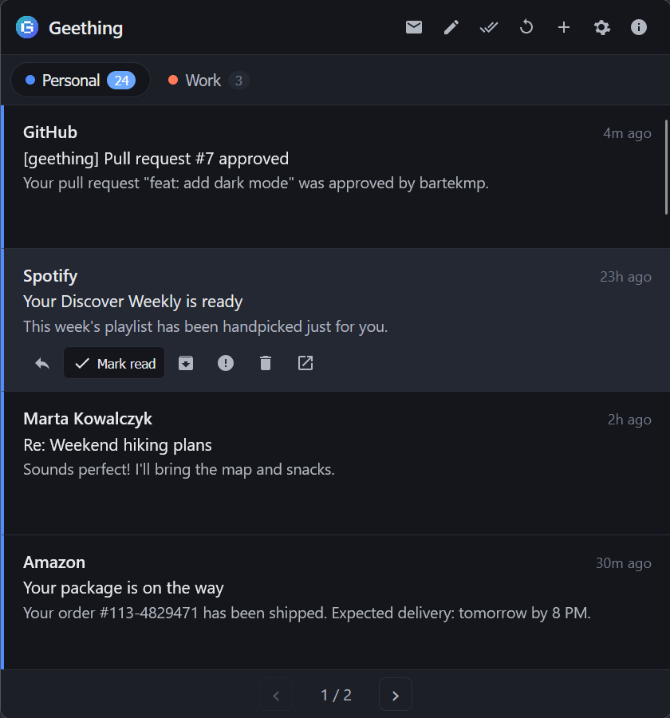
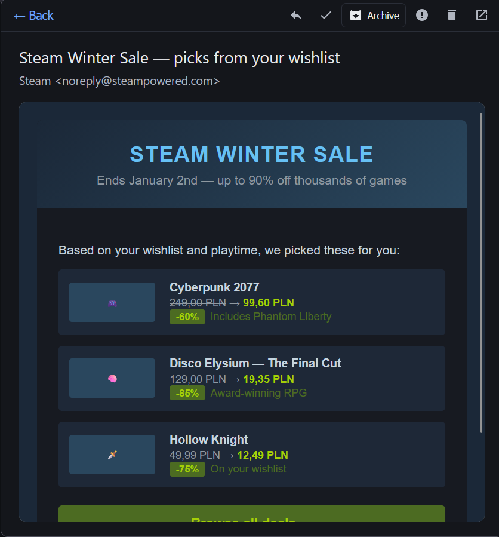
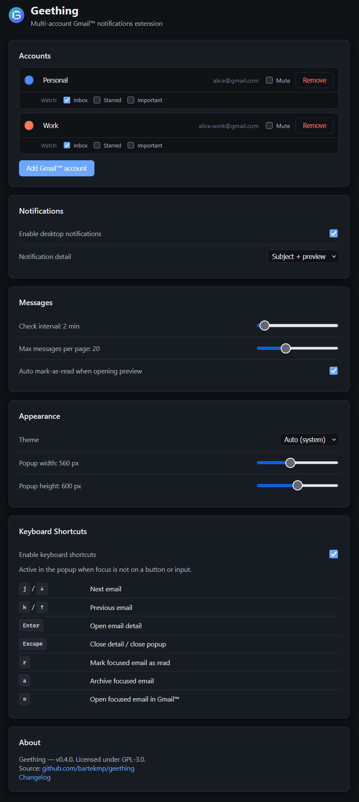
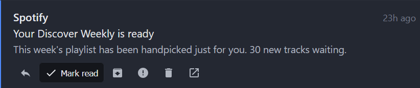

# Geething

A browser extension for multi-account Gmail™ notifications. Get a badge counter, desktop notifications with action buttons, and a full-featured popup — all without a backend server. Your data never leaves your device.

<br clear="left" />

[](https://geething.eu)
[](https://addons.mozilla.org/en-US/firefox/addon/geething/)
[](https://github.com/bartekmp/geething/releases/latest)

## Features

- **Free and open source** — no ads, no tracking, no paywalls; licensed under GPL-3.0
- **Multiple Gmail™ accounts** — add as many as you need, each with its own color and label
- **Badge counter** — total unread count across all accounts, shown on the toolbar icon
- **Desktop notifications** — notified the moment new mail arrives; click to open, or use the built-in **Mark as Read** / **Archive** buttons directly in the notification
- **Popup** — tabbed per-account view with sender, subject, and snippet; click any email to read it inline
- **Quick actions** — mark as read, archive, move to spam, delete, reply, or open in Gmail™, all without leaving the extension
- **Themes** — light, dark, or auto (follows system preference)
- **Configurable** — poll interval (1–30 min), max messages per page (5–50), popup size, keyboard shortcuts, and more
- **Limits** — up to 100 unread messages are fetched per inbox per poll; emails larger than 5 MB cannot be previewed inline (open in Gmail™ instead)

| Popup | Message Preview | Settings | Quick actions |
|-------|---------|---------|-----------------|
|  |  |  |  |

## Installation

### Firefox Add-ons (recommended)

**[Install from Firefox Add-ons (AMO)](https://addons.mozilla.org/en-US/firefox/addon/geething/)**

### Manual installation (developer mode)

1. Download the latest `.xpi` from [Releases](https://github.com/bartekmp/geething/releases).
2. Open Firefox and go to `about:addons`.
3. Click the gear icon → **Install Add-on From File…**
4. Select the downloaded `.xpi`.

## Google account warning

When adding a Gmail account you will see a Google warning: **"This app hasn't been verified by Google"**. This is expected and safe to dismiss — it appears because Geething is an independent open-source project and Google's verification programme for apps that access Gmail requires a paid third-party security audit (~$3,000). The extension is not enrolled in that programme.

You can verify for yourself that the extension is safe:
- The full source code is in this repository — nothing is hidden or obfuscated.
- No data ever leaves your device. All Gmail access happens directly between your browser and Google's API.
- OAuth tokens are stored only in Firefox's local extension storage.

To proceed past the warning: click **Advanced** → **Go to Geething (unsafe)**.

## Building from source

The published AMO release has credentials embedded — you only need this if you're building the extension yourself (e.g. to contribute or fork).

1. Go to [Google Cloud Console](https://console.cloud.google.com/) and create a project, enable the **Gmail API**, and create an OAuth 2.0 client ID (type: **Web application**).
2. Add an Authorised redirect URI: `https://geething.eu/oauth.html`
3. Copy `src/shared/credentials.example.js` → `src/shared/credentials.js` and fill in your Client ID and Secret.
4. Run `npm run dev` to launch Firefox with the extension loaded.

## Development

```bash
npm install
npm run dev          # launches Firefox with the extension loaded
npm run seed         # launches Firefox with pre-seeded fake accounts and emails (no real OAuth)
npm test             # unit tests (single run)
npm run test:watch   # watch mode
npm run test:coverage
npm run lint
npm run lint:fix
npm run format:check
npm run format
npx web-ext lint --source-dir=src
npm run build        # produces a .zip in web-ext-artifacts/
```

## Privacy

- No backend server, no analytics, no telemetry.
- OAuth tokens are stored only in your browser's local extension storage (encrypted at rest by Firefox).
- Email content is fetched directly from Google's API and never transmitted anywhere else.

### Why OAuth instead of browser cookies?

Some Gmail extensions (including the popular [Checker Plus for Gmail](https://jasonsavard.com/Checker-Plus-for-Gmail)) discover your accounts automatically by reading your browser's active Google session cookies. That approach is convenient, but comes with trade-offs.

Geething authenticates each account explicitly through Google's OAuth 2.0 flow instead:

- **Works independently of your browser session** — tokens persist across restarts, cookie clears, and incognito windows. Cookie-based extensions stop working the moment you sign out of Google in your browser.
- **Official API only** — the session-cookie approach relies on undocumented Google internal endpoints that can change without notice. Geething uses only the published Gmail API.
- **Minimal, declared scope** — you grant exactly the permissions the extension needs. Cookie access gives the extension implicit access to your full authenticated Google session.
- **Revocable at any time** — you can revoke Geething's access per-account from [Google Account → Security → Third-party access](https://myaccount.google.com/permissions), independently of your browser or the extension itself.

## License

GPL-3.0 — see [LICENSE](LICENSE).
